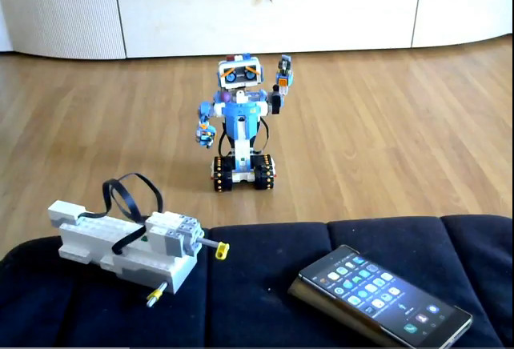
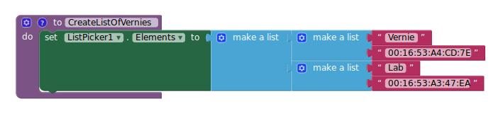

# AppInventor-Vernie

This is an App I made with MIT App Inventor 2 for my Android phone.
It allows me to control LEGO BOOST Vernie movement with a basic joystick and to shoot the "cannon" with a button.
The color sensor status is also continuously shown.

# Usage

:

The user can **[Choose]** from a list of several Vernies. For the moment, this list is prebuild so you need to edit the .aia file and use the BLE address of your own devices then **[Connect]** to the chosen one.

The joystick controls both tracks at the same time. Speed is proportional to amplitude and the direction of motion is related to the angle so moving joystick to:
- Front: moves forward
- Back: moves backwards
- Right: turns right
- Left: turns left

And moving somewhere between these directions gives a mix forward/backward and rotation.

The joystick doesn't return to center when not in use. This is intended, so you can fix a direction and speed until you press 
the **[Reset]** button or move yourself the joystick back to center (not easy).

The **[Shoot]** button makes the head turn enough to trigger the "cannon"... most of the times.

I made a [simple video](https://youtu.be/_WaZL8dOFf4) showing how it works:

# Requirements

You need [MIT App Inventor 2](http://ai2.appinventor.mit.edu). It's a great tool but for the moment it only builds Android apps altough it is expected to support iOS very soon.

LEGO BOOST set uses Bluetooth Low Energy so we also need the BluetoothLE extension. Current official version is available [here](http://iot.appinventor.mit.edu/assets/resources/edu.mit.appinventor.ble.aix) but I used the [2.1 Release Candidate 4](https://www.google.com/url?q=https%3A%2F%2Fwww.dropbox.com%2Fs%2Fsic9kvft8atynly%2FBLE-v2.1-rc4.aix%3Fdl%3D0&sa=D&sntz=1&usg=AFQjCNHFymz0G27-XELIu0mMk3016QMn_g) without issues.

For the moment, you need to know the BLE address of your LEGO BOOST Move Hub. You can use a free Android app from Nordic, nRF Connect, to get this address.
It's easy to get a dynamic list of the BLE devices found nearby but my office has so many bluetooth devices that my phone
screen got cluttered, will later try a better version that filters BLE addresses by manufacturer and shows only LEGO devices.

# Explaining the App "code"

If you import the .aia file you will see on the Designer View that the App uses the follow visual components, all on the same default *Screen*:

- BtnConnection
- ListPicker1
- Image1
- LblRadius
- LblXY
- LabelJoystick
- BtnRst
- CanvasJoystick
- ImgSpriteJoystick
- BtnShoot

For convenience these UI components are arranged inside Horizontal Arrangements and there also a few labels that I
use as spacers, these components are just cosmetic so are not listed above.

There are also a fee non-visual components:

- One *Extension*, BluetoothLE1. This contains all Bluetooth Low Energy components required to talk with Vernie.
- Two *Sensors* (ClockTracks and ClockShoot). The first is used to regularly send motor commands to Vernie and the second to implement a delay between back and forth movements of the head when triggering the "cannon".
- Three *Image Files* (two for the joystick *Canvas* and *Sprite* and the other, a photo of Vernie, used as *Image1* and
also used as the Application Icon in the *Screen* properties)

When the App starts, it initializes the *Screen* and defines a few global variables:

**MAXRADIUS**, **X0** and **Y0** are constants used with the joystick. If you change joystick properties you need to update
these values.

**SpeedA** and **SpeedB** are global variables containing the speed of motors A and B. Every **TRACKSPERIOD** milliseconds
a BLE command is sent to update motors speed. You will notice that TRACKSPERIOD = 100 results in Vernie moving slower
than you would expect. You can increase this value up to 255 but higher values might result is worst response times
when changing Vernie's speed or direction.

**ServiceUUID** and **CharUUID** are the Bluetooth Low Energy UUIDs implemented by LEGO for the BOOST Move Hub (Vernie's core)
and are required by the BluetoothLE extension blocks. This UUID's are defined in the firmware so it's possible
that future firmware upgrades brake this - you can always check these UUID with a BLE App like Nordic nRF Connect for
Android.

**SHOOTDELAY**, **SHOOTROTATION** and **SHOOTSPEED** are constants used for triggering Vernie's "cannon" with its head.

On Screen initialization we start BLE scanning, this is required before we can stablish a BLE connection to Vernie.
Then we create a static list with our Vernies nicknames and BLE Addresses, set the text and color of some buttons
and labels and create the Joystick, moving the smaller circled sprite to the center of the larger circled canvas
at (**X0**,**Y0**). Finally we initialize both clocks timers, disabling them until they are required.

Before we can connect to Vernie we need to **[Choose]** which Vernie from a list availabe in **ListPicker1**.
Each Vernie in this list is also a list of two elements: a nickname defined by us (like 'My1stVernie') and a BLE
address.

We update the **ListPick1**'s Text property with the nickname of the device we chose (that's first element of the pair;
the second element, the BLE address, will be used to stablish the connection).

Connection (and disconnection) is done through **BtConnection**. As soon as a connection is made we start sending
motor commands to motor A+B (tracks) and receiving notifications from the Color/Distance Sensor (in fact we receive all
kind of notifications from Vernie's Move Hub but will only pay attention to data related to the Color/Distance Sensor).

After connection, we can control Vernie movements with the Joystick. Previously I was using two sliders,
one for each track. But at the end of December there was an upgrade to App Inventor and now sliders don't work on my
Android 5.0 phone so while I'm waiting for a fix I decided to use a Joystick.

Te joystick is the bigger block part of this App "code" and also the most complex:

The idea is not new, you can see others like this one by [Alan Jackson](https://sites.google.com/site/alanjacksoncsportfolio/app-inventor-joystick). I use a Canvas component, with a circle image as a background, and a Image Sprite component,
with a smaller circle image as the "stick".

Some trigonometry concepts are used that I will not detail here but the basic idea is that each time the sprite is
dragged we need to find it's position and decide if it is valid or not by calculating its distance to the center
with the 'radius' procedure - if OK we accept, if not we force the sprite to stay on the border of the joystick area to
prevent it to go outside.

Then we 'rotate' our joystick 45º to calculate the speed values to apply to each motor. This is a common trick used with
tank driving, you can read some ideas [here](https://electronics.stackexchange.com/questions/19669/algorithm-for-mixing-2-axis-analog-input-to-control-a-differential-motor-drive).

I use a 'Info' procedure to display the current coordinates of the Joystick, the calculated radius and angle and the
resulting speed values. If you don't want to see this values just disable the 'call Info' block.

A real joystick would return to center when released but I prefer to let it stay where it was left. I'm not a good driver so
this way I can make Vernie go straight in one direction while doing other things. There is **[Reset]** button that can also
work as an emergency brake

Now that we have the Speed values for motor A and B we need to send them to Vernie. This is done every time the timer
defined for **ClockTracks** triggers (the period is defined by **TRACKSPERIOD**).

Since Vernie uses motors A and B for movement I'm using a single timed motor command (the firmware has commands for every
single motor but also for the A+B pair). The BluetoothLE extension has a WriteBytesWithResponse that I use to send this
command, as a list of unsigned bytes. The timed motor command accepts a duration (**TRACKSPERIOD**) and a speed value for each
motor. If the speed value is between 0 and 100 the motor rotates in one direction, to rotate in the other direction we should
send '256-speed' but App Inventor takes care of that for us if we give a negative value.

Now for triggering the cannon we use a much simpler block of code:

When the **[Shoot]** button is touched, we turn Vernie's head until it touches the cannon's trigger. Then we wait just a bit
and return the head to it's initial position. This is done by enabling a second clock timer after the first movement and
waiting for the timer to trigger to make the second movement.

Instead of timed motor commands we now use angle motor commands and we use predefined values **SHOOTROTATION** and
**SHOOTSPEED**. You can see that to return the head we multiply **SHOOTSPEED** by -1 instead of giving a negative angle.

Last part is the Color Sensor. It is in fact a Color and Distance Sensor but for now I'm just using it to identify colors. 

When the BLE connection to Vernie is made we enable the Color Sensor and at the same time we *subscribe* for Vernie's *notifications*. That means that we don't need to keep asking Vernie to read a color, he will send it to us whenever it
detects a change in the sensor (not necessarily a change in color).

In fact, we are subscribing to *ALL* kind of notifications, not just for Color Sensor notifications. But we will just pay
attention to the Color values by parsing the Bytes we receive: if the notification starts with 8 (that means is 8-byte long)
and next 3 bytes are '0', '69', '1' then we receive a color (or distance) notification. If the next byte is not 255 then it
is a color and we use **GetColorName** function to retrieve it.

# Future improvements

For the moment I have two ideas:
- improve the BytesReceived block to also detect Distance values, not just Color.
- scan all BLE devices nearby, parse their address and display a list off only those which start with LEGO address ("00:16:53") to let the user choose any Vernie around, not just the already known.

Thanks for reading all this, I hope you can make good use of all it.

Leg Godt / Play Well !
